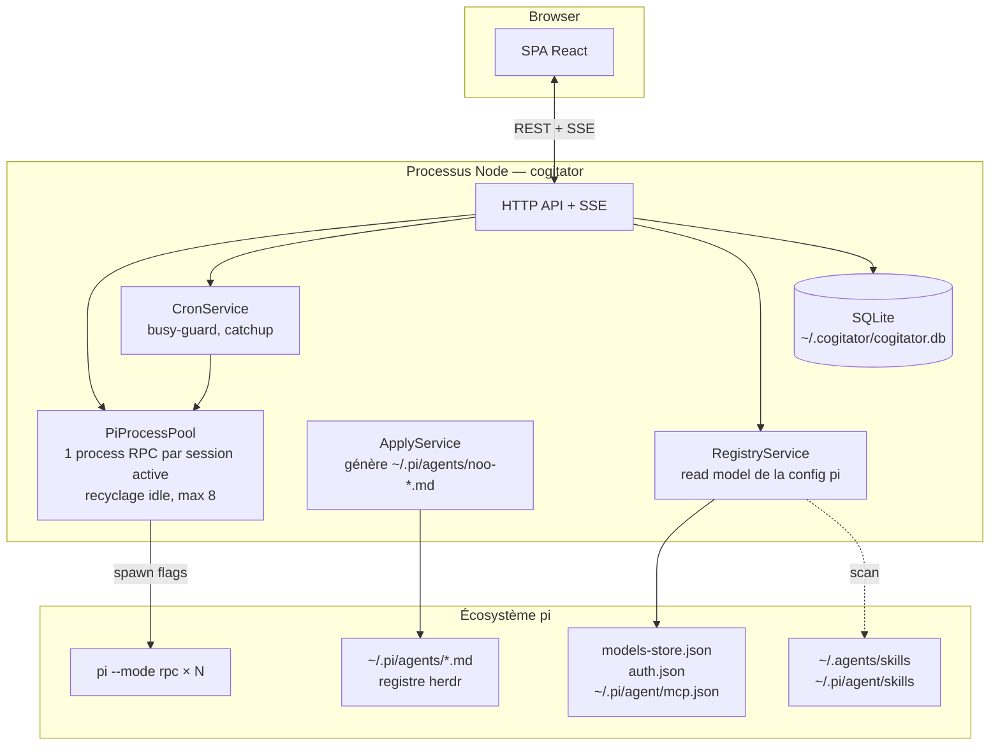

# Blueprint — Cogitator

## Vue d'ensemble



Le serveur est un **processus Node standalone** (`cogitator` / `npx @ignitionai/cogitator`). Le paquet pi installe aussi une commande `/cogitator` qui démarre le serveur **détaché** (le cron doit survivre à la fermeture de la session pi).

## Matérialisation des presets en flags

À chaque spawn, le preset devient :

| Champ du preset | Flag pi | Notes |
|---|---|---|
| provider + model + thinking | `--model <provider>/<id>:<thinking>` | ou `--provider` + `--model` |
| system_prompt | `--append-system-prompt <fichier généré>` | prompt écrit dans `~/.cogitator/tmp/<conv>-prompt.md` |
| skills | `--no-skills` + `--skill <path>` (répété) | l'agent n'a QUE ses skills — pas les ~140 globaux |
| tools_allowlist | `--tools "a,b,c"` / `--exclude-tools` | null = rien à passer |
| mcp_servers | **pas de flag** → `pi.registerMcpServer()` | l'extension cogitator enregistre les serveurs du preset au `session_start` (API officielle, shape `mcpServers`) |
| subagent setups | rien au spawn | les `.md` herdr générés à l'Apply sont déjà visibles du process |

Zéro fichier écrit dans les workspaces. Zéro dépendance au répertoire de lancement : les flags suffisent.

## PiProcessPool

Modèle éprouvé (cf. pi-web-simple) :

- 1 process `pi --mode rpc` par conversation active, via le `RpcClient` officiel (`@earendil-works/pi-coding-agent`)
- **spawn paresseux** : la conversation démarre à la première activité
- **recyclage idle** : 10 min sans activité → stop (la session `.jsonl` survit, re-spawn transparent au prochain message)
- **plafond 8** : au-delà, les conversations les plus anciennes passent en état `idle` (swap, pas de kill de travail en cours)

## ApplyService (subagents)

Au save d'un AgentPreset :

1. Les SubagentSetups sont rendus en définitions herdr : `~/.pi/agents/noo-<agent-slug>-<sub-slug>.md` (frontmatter name/description/kind/model/thinking/tools/skills)
2. Un subagent retiré du preset → son `.md` est supprimé
3. Le store cogitator garde une **copie de travail** pour l'UI (formulaires, validation) — mais l'exécution ne lit que le registre herdr (ADR-005)

## CronService

```
cron tick → tâche due ?
  ├── run précédent actif ? → busy_policy : skip | queue | kill
  ├── catchup && runs manqués (serveur arrêté) ? → 1 run de rattrapage
  └── spawn pi -p --mode rpc (agent, workspace) → sortie append dans la session dédiée
        → CronRun(status, session_file, erreur éventuelle)
```

**Limite assumée** : le cron ne tourne que si le serveur cogitator tourne. Affiché dans l'UI.

## UI — écrans

1. **Conversations** (dashboard) : toutes les sessions, libres ou par workspace, statut, modèle
2. **Workspaces** : cartes (dossier, nb sessions, agent par défaut), création via file-picker serveur
3. **Agents** : liste + éditeur de preset complet (providers/modèles en cascade, skills multi-select scannés, MCP, éditeur de subagents)
4. **Providers** : read model pi (providers, statut auth, modèles), édition guidée de `models.json` / `auth.json` (atomic + backup)
5. **Cron** : tâches + historique des runs, fire manuel
6. **Settings** : port, idle timeout, plafond de sessions, thème
