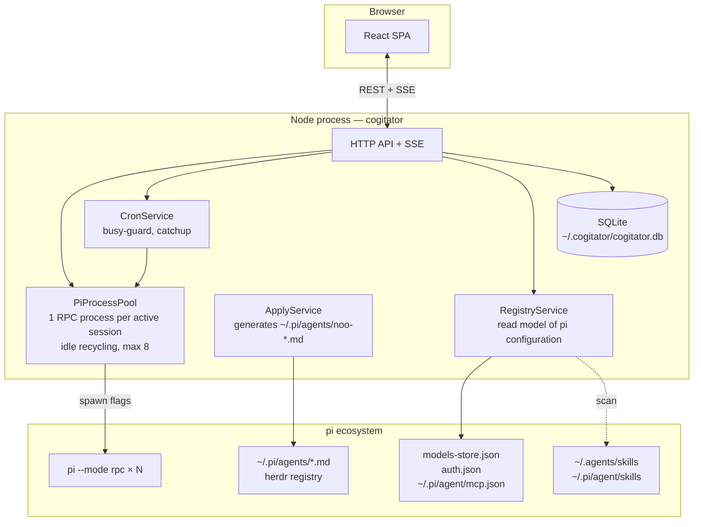

# Blueprint — Cogitator

## Overview



The server is a **standalone Node process** (`cogitator` / `npx @ignitionai/cogitator`). The pi package also installs a `/cogitator` command that starts the server **detached** (cron must survive the pi session closing).

<a id="materialisation-des-presets-en-flags"></a>

## Materializing presets as flags

At each spawn, the preset becomes:

| Preset field | pi flag | Notes |
|---|---|---|
| provider + model + thinking | `--model <provider>/<id>:<thinking>` | or `--provider` + `--model` |
| system_prompt | `--append-system-prompt <generated file>` | prompt written to `~/.cogitator/tmp/<conv>-prompt.md` |
| skills | `--no-skills` + `--skill <path>` (repeated) | the agent has ONLY its own skills — not the ~140 global ones |
| tools_allowlist | `--tools "a,b,c"` / `--exclude-tools` | null = nothing to pass |
| mcp_servers | **no flag** → `pi.registerMcpServer()` | the cogitator extension registers the preset's servers at `session_start` (official API, `mcpServers` structure) |
| subagent setups | nothing at spawn | the herdr `.md` files generated by Apply are already visible to the process |

No files written to workspaces. No dependency on the launch directory: the flags are sufficient.

## PiProcessPool

Proven model (see pi-web-simple):

- 1 `pi --mode rpc` process per active conversation, via the official `RpcClient` (`@earendil-works/pi-coding-agent`)
- **lazy spawn**: the conversation starts on first activity
- **idle recycling**: 10 min without activity → stop (the `.jsonl` session survives, with a transparent respawn on the next message)
- **cap of 8**: beyond this, the oldest conversations transition to `idle` (swap, without killing ongoing work)

## ApplyService (subagents)

When an AgentPreset is saved:

1. SubagentSetups are rendered as herdr definitions: `~/.pi/agents/noo-<agent-slug>-<sub-slug>.md` (frontmatter name/description/kind/model/thinking/tools/skills)
2. A subagent removed from the preset → its `.md` file is deleted
3. The cogitator store keeps a **working copy** for the UI (forms, validation) — but execution reads only the herdr registry (ADR-005)

## CronService

```
cron tick → task due?
  ├── previous run active? → busy_policy: skip | queue | kill
  ├── catchup && missed runs (server stopped)? → 1 catch-up run
  └── spawn pi -p --mode rpc (agent, workspace) → append output to the dedicated session
        → CronRun(status, session_file, possible error)
```

**Accepted limitation**: cron runs only while the cogitator server is running. Displayed in the UI.

## UI — screens

1. **Conversations** (dashboard): all sessions, standalone or by workspace, status, model
2. **Workspaces**: cards (directory, session count, default agent), creation via server-side file picker
3. **Agents**: list + full preset editor (cascading providers/models, scanned skills with multi-select, MCP, subagent editor)
4. **Providers**: pi read model (providers, authentication status, models), guided editing of `models.json` / `auth.json` (atomic + backup)
5. **Cron**: tasks + run history, manual trigger
6. **Settings**: port, idle timeout, session cap, theme
