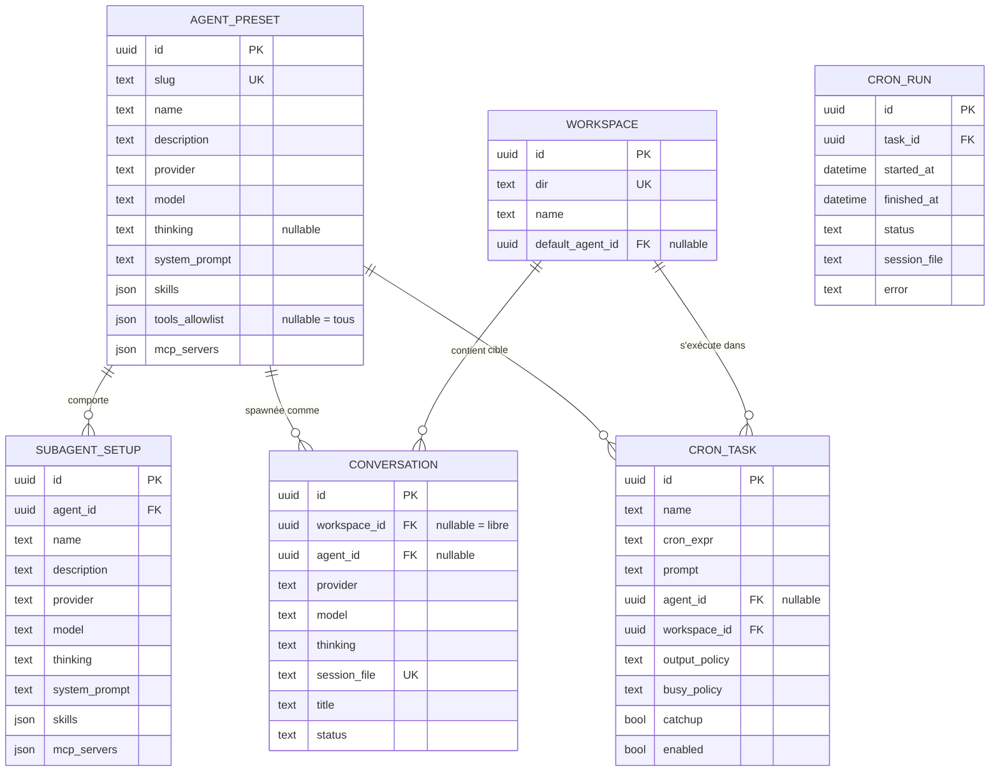

# Domain Model — Cogitator

## Bounded contexts

| Contexte | Responsabilité | Entités |
|---|---|---|
| **Registry** | Lire/écrire la config native de pi (providers, modèles, auth, MCP user-level, skills) | ProviderRef (read model), SkillRef (read model) |
| **Agents** | CRUD des presets d'agents et des setups de subagents | AgentPreset, SubagentSetup |
| **Workspaces** | CRUD des workspaces (dossier + métadonnées) | Workspace |
| **Conversations** | Spawn, cycle de vie, streaming des sessions pi | Conversation |
| **Schedules** | Cron, historique d'exécution | CronTask, CronRun |

Le Registry ne **duplique** pas la config de pi : c'est un read model rafraîchi depuis `models-store.json`, `auth.json`, `~/.pi/agent/mcp.json` + scan des emplacements de skills. Les écritures passent par des endpoints dédiés (atomic write + backup).

## Entités cœur

### AgentPreset (agrégat central)

Un preset fige la configuration complète d'un agent. Il est **immu-able à l'exécution** : à chaque spawn, il est matérialisé en flags pi (voir [blueprint](blueprint.md#materialisation-des-presets-en-flags)).

| Champ | Type | Invariant |
|---|---|---|
| id | uuid | — |
| slug | texte unique | kebab-case, ≤64 caractères |
| name, description | texte | description utilisée pour le routing |
| provider | texte | doit exister dans le catalogue pi (`pi auth check`) |
| model | texte | doit appartenir au provider |
| thinking | texte \| null | niveau pi : off…max |
| system_prompt | texte | scope de l'agent |
| skills | json[] | chemins existants sur disque |
| tools_allowlist | json[] \| null | null = tous les outils |
| mcp_servers | json[] | entrées au format `mcpServers` |

### SubagentSetup

Enfant d'AgentPreset (1–N). Même shape de config, plus un `name` unique par agent. À l'Apply, généré en définition herdr native (`~/.pi/agents/noo-<agent>-.md`) — une seule vérité d'exécution, visible aussi depuis la CLI.

**Invariant** : pas de cycle — un SubagentSetup ne peut pas référencer son AgentPreset parent.

### Workspace

| Champ | Invariant |
|---|---|
| id, name | — |
| dir | **unique**, dossier existant sur disque |
| default_agent_id | FK nullable vers AgentPreset |

Le workspace hérite de tout le mécanisme cwd-bound de pi : skills projet, settings projet, approvals MCP, sessions rattachées au dossier.

### Conversation

| Champ | Invariant |
|---|---|
| id | — |
| workspace_id | **nullable** — null = conversation libre |
| agent_id | FK nullable — null = provider/modèle choisis ad hoc |
| provider, model, thinking | **snapshot figé au spawn** |
| session_file | chemin du `.jsonl` pi (unique) |
| status | spawning \| active \| idle \| dead |

Une conversation ouverte **garde sa config** : toute modification de preset n'affecte que les spawns suivants (décision ADR-001).

### CronTask / CronRun

| CronTask | Invariant |
|---|---|
| id, name | — |
| cron_expr | expression cron valide (5 ou 6 champs) |
| prompt | texte tiré à l'heure H |
| agent_id, workspace_id | cibles (agent recommandé, workspace hébergeant la session) |
| output_policy | append_session \| new_session |
| busy_policy | skip \| queue \| kill |
| catchup | bool — 1 run de rattrapage si des runs ont été manqués |

**Invariant** : jamais 2 runs simultanés de la même tâche (busy-guard). CronRun trace chaque exécution (status, session, erreur).

## Diagramme ER

## Store

SQLite unique : `~/.cogitator/cogitator.db` (ADR-006). Les colonnes `json` utilisent JSON1. Aucune donnée de conversation dans la base : les transcripts vivent dans les `.jsonl` pi (source de vérité), la base ne garde que les métadonnées.
