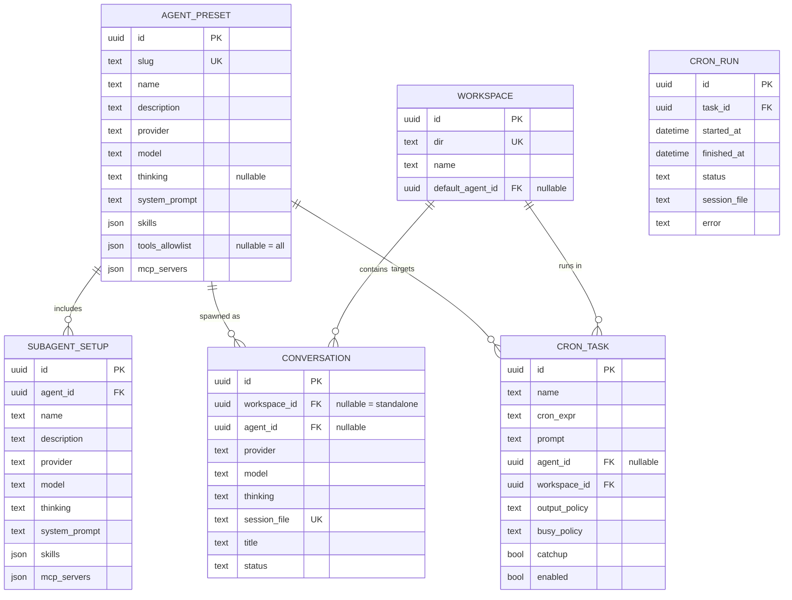

# Domain Model — Cogitator

## Bounded contexts

| Context | Responsibility | Entities |
|---|---|---|
| **Registry** | Read/write pi's native configuration (providers, models, authentication, user-level MCP, skills) | ProviderRef (read model), SkillRef (read model) |
| **Agents** | CRUD for agent presets and subagent setups | AgentPreset, SubagentSetup |
| **Workspaces** | CRUD for workspaces (directory + metadata) | Workspace |
| **Conversations** | Spawn, lifecycle, streaming of pi sessions | Conversation |
| **Schedules** | Cron, execution history | CronTask, CronRun |

The Registry does not **duplicate** pi's configuration: it is a read model refreshed from `models-store.json`, `auth.json`, `~/.pi/agent/mcp.json` + a scan of skill locations. Writes go through dedicated endpoints (atomic write + backup).

## Core entities

### AgentPreset (central aggregate)

A preset captures an agent's full configuration. It is **immutable at runtime**: at each spawn, it is materialized as pi flags (see [blueprint](blueprint.md#materialisation-des-presets-en-flags)).

| Field | Type | Invariant |
|---|---|---|
| id | uuid | — |
| slug | unique text | kebab-case, ≤64 characters |
| name, description | text | description used for routing |
| provider | text | must exist in the pi catalog (`pi auth check`) |
| model | text | must belong to the provider |
| thinking | text \| null | pi level: off…max |
| system_prompt | text | agent scope |
| skills | json[] | existing paths on disk |
| tools_allowlist | json[] \| null | null = all tools |
| mcp_servers | json[] | entries in `mcpServers` format |

### SubagentSetup

Child of AgentPreset (1–N). Same configuration structure, plus a `name` unique within each agent. On Apply, generated as a native herdr definition (`~/.pi/agents/noo-<agent>-.md`) — a single runtime source of truth, also visible from the CLI.

**Invariant**: no cycles — a SubagentSetup cannot reference its parent AgentPreset.

### Workspace

| Field | Invariant |
|---|---|
| id, name | — |
| dir | **unique**, existing directory on disk |
| default_agent_id | nullable FK to AgentPreset |

The workspace inherits pi's entire cwd-bound mechanism: project skills, project settings, MCP approvals, sessions attached to the directory.

### Conversation

| Field | Invariant |
|---|---|
| id | — |
| workspace_id | **nullable** — null = standalone conversation |
| agent_id | nullable FK — null = provider/model chosen ad hoc |
| provider, model, thinking | **snapshot frozen at spawn** |
| session_file | path to the pi `.jsonl` (unique) |
| status | spawning \| active \| idle \| dead |

An open conversation **keeps its configuration**: preset changes affect only subsequent spawns (decision ADR-001).

### CronTask / CronRun

| CronTask | Invariant |
|---|---|
| id, name | — |
| cron_expr | valid cron expression (5 or 6 fields) |
| prompt | text sent at the scheduled time |
| agent_id, workspace_id | targets (agent recommended, workspace hosting the session) |
| output_policy | append_session \| new_session |
| busy_policy | skip \| queue \| kill |
| catchup | bool — 1 catch-up run if runs were missed |

**Invariant**: never 2 simultaneous runs of the same task (busy-guard). CronRun records each execution (status, session, error).

## ER diagram

## Store

Single SQLite database: `~/.cogitator/cogitator.db` (ADR-006). The `json` columns use JSON1. No conversation data in the database: transcripts live in pi's `.jsonl` files (source of truth); the database keeps only metadata.
